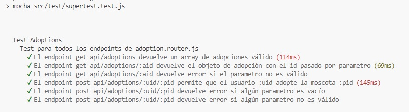

# Entrega final del Curso de PROGRAMACION BACKEND III de CODERHOUSE

### Descripción del proyecto:

Se tomó como base el proyecto de un servidor basado en Node.JS y express, con persistencia en una base de datos Mongo. Se creó un módulo de Mocking con el fin de generar mascotas y usuarios. Se incorpora Faker-js. Se documentó con Swagger el módulo “Users”. Se desarrollaron los tests funcionales para todos los endpoints del router “adoption.router.js”. Se generó una imagen Docker del proyecto.

### Pasos para probar el proyecto:

- Desde una terminal clonar el proyecto en su máquina local

```batch
git clone https://github.com/ingridlch/EntregaBackend3.git
```

- Situarse en el directorio del proyecto que se creó al clonar e instalarlo con:

```batch
npm install
```

- Configurar las variables de entorno en el archivo .env ubicado en la raíz del proyecto. En env.example se listan cuales se deben configurar.

### Imagen Docker del proyecto

https://hub.docker.com/repositories/ingridlochi/adoptme

### Endpoints de la API

Se incluyen capturas de pruebas realizadas en Postman que demuestran su funcionamiento, de los registros generados en Mongo, y resultados de test funcionales para todos los endpoints del router “adoption.router.js”

**GET** `/api/adoptions`: Busca y lista adopciones realizadas.


**GET** `/api/adoptions/:aid`: Busca y muestra la adopción de parametro :aid.


**POST** `/api/adoptions/:uid/:pid`: Crea adopción de la mascota :pid al usuario :uid.





**GET** `/api/mocks/mockingpets`: Genera 100 mascotas con el mismo formato que entregaría una petición de Mongo (sin owner y con adopted en “false”). Se le puede pasar por query el parámetro cant para generar cant mascotas.


**GET** `/api/mocks/mockingusers`: Genera 50 usuarios con el mismo formato que entregaría una petición de Mongo. La “password” contiene la contraseña “coder123” encriptada, el valor “role” varía entre “user” y “admin”, y o “pets” se completa con un array vacío. Se le puede pasar por query el parámetro cant para generar cant users.


**POST** `/api/mocks/generateData`: Recibe los parámetros numéricos "users" y "pets" para generar e insertar en la base de datos la cantidad de registros indicados. Se comprueba dichos registros insertados con los servicios GET de users y pets (/api/users y /api/pets).


### Documentación con Swagger del módulo “Users”

Se incluye captura de la vista generada:

